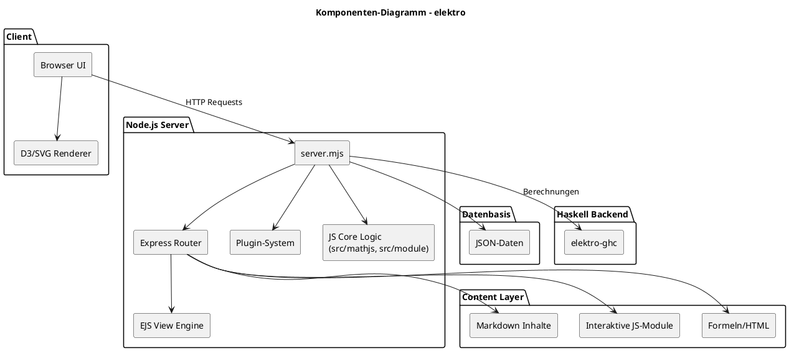
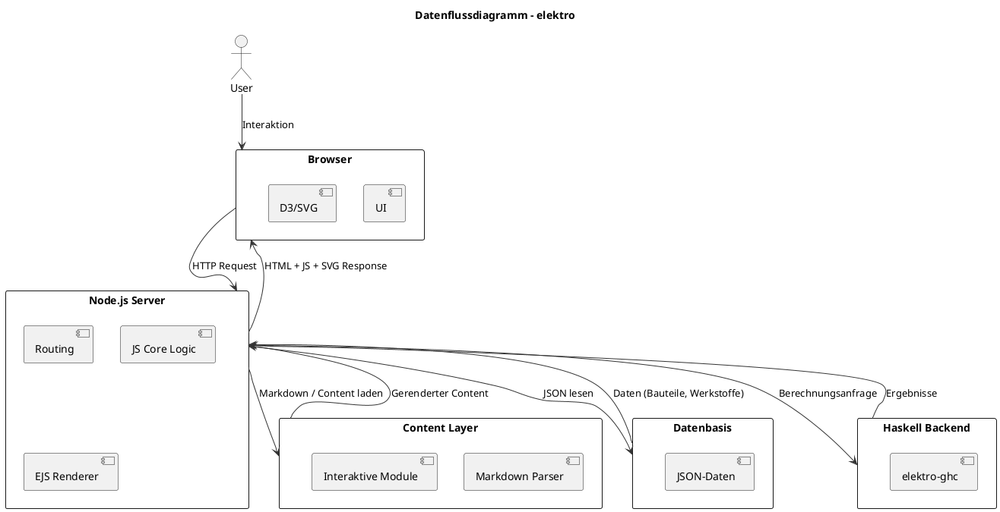
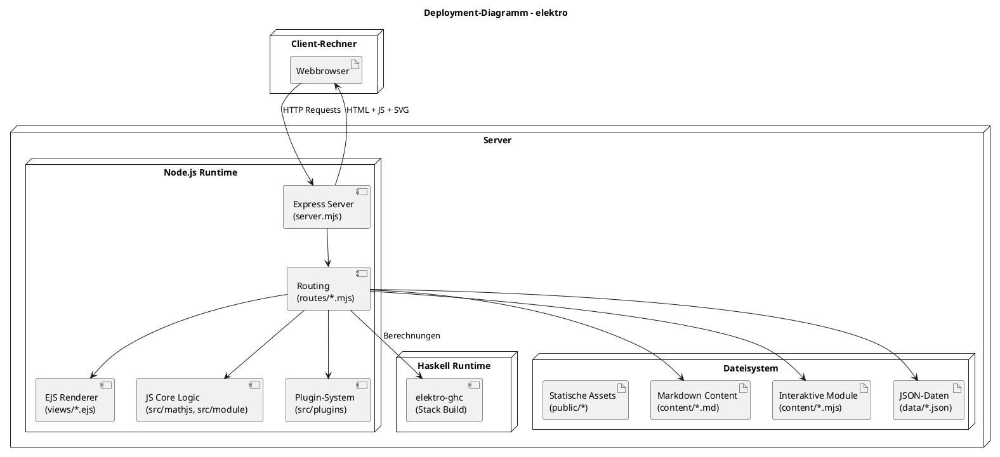
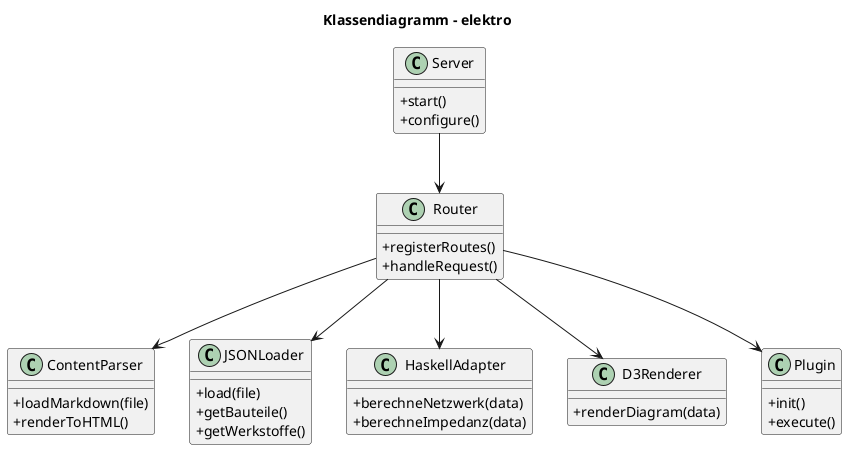
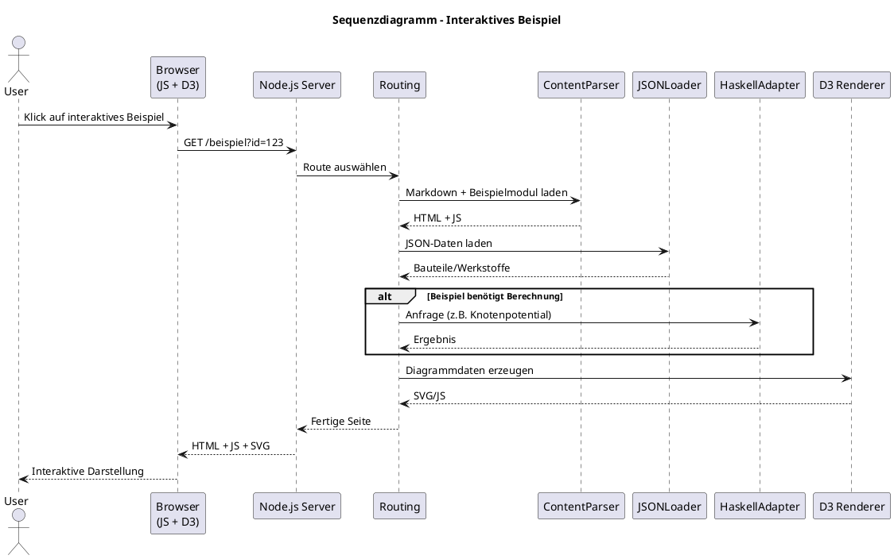
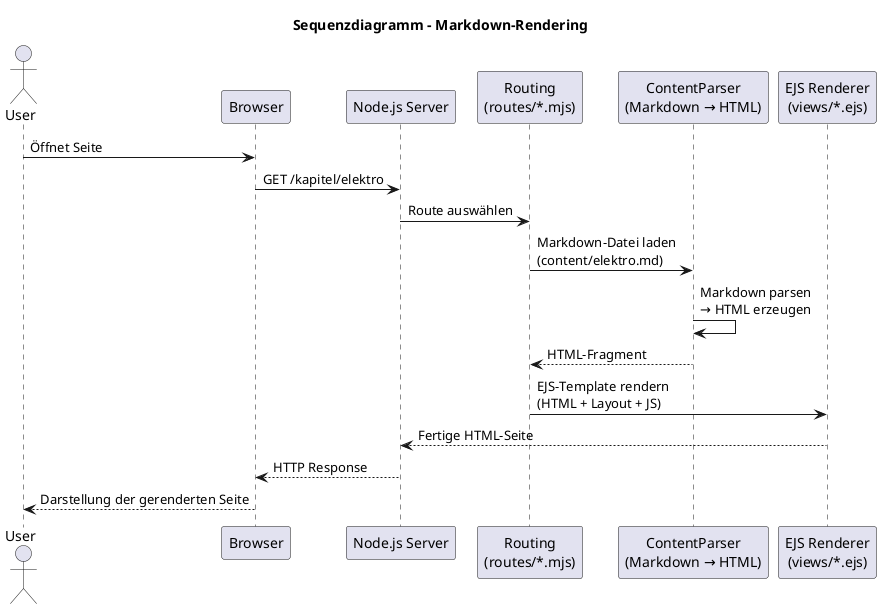
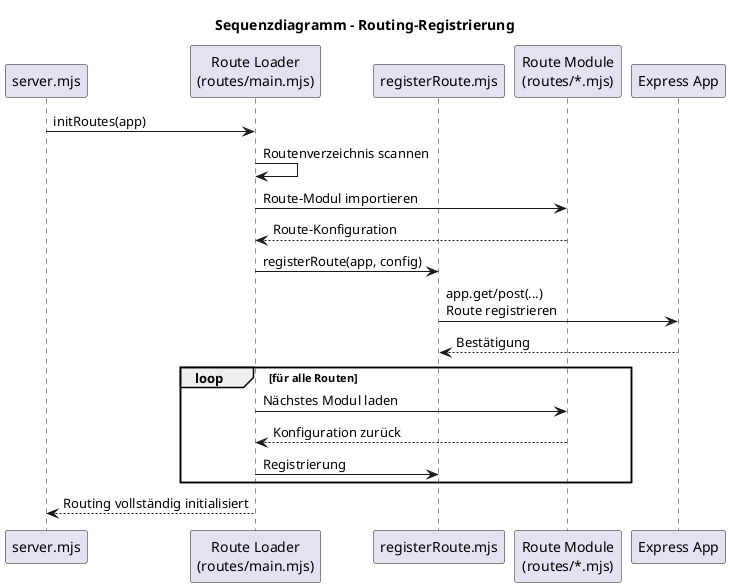

Hier ist ein **vollständig ausgearbeitetes, professionelles README.md**, das exakt zu deiner Projektstruktur passt und sofort einsatzbereit ist.
Ich habe es so geschrieben, dass es sowohl technisch versierte Nutzer als auch Lernende abholt und die Architektur klar erklärt.

---

# elektro
Interaktive Lern‑ und Experimentierplattform für Elektrotechnik
Node.js‑Server • Haskell‑Backend • D3‑Visualisierungen • Markdown‑Content

---

## Überblick
**elektro** ist eine modular aufgebaute Plattform zur Darstellung, Berechnung und Visualisierung elektrotechnischer Inhalte.
Sie kombiniert:

- einen Express‑basierten Node.js‑Server
- ein Haskell‑Backend für mathematische und elektrische Kernfunktionen
- interaktive D3‑Diagramme und SVG‑Grafiken
- Markdown‑basierte Inhalte und Beispiele
- strukturierte JSON‑Daten zu Bauteilen, Werkstoffen und Kennzeichnungen

Das Projekt eignet sich sowohl für Lernende als auch für Entwickler, die elektrotechnische Inhalte dynamisch darstellen oder erweitern möchten.

---

## Features

- Interaktive Beispiele zu Gleich‑ und Wechselspannung
- Markdown‑basierte Kapitel, Formeln und Aufgaben
- D3‑basierte Diagramme und SVG‑Visualisierungen
- JSON‑Datenbasis für Bauteile, Leiterwerkstoffe und Kennzeichnungen
- Express‑Server mit EJS‑Views und modularer Routenstruktur
- Haskell‑Module für mathematische Kernlogik und Netzwerkanalyse
- Erweiterbares Plugin‑System für neue Visualisierungen und Inhalte

---

## Projektstruktur

| Ordner | Beschreibung |
|--------|--------------|
| `src/` | Kernlogik (Node‑Module, Haskell‑Integration, Plugins, Math‑Funktionen) |
| `content/` | Fachliche Inhalte: Markdown‑Kapitel, Formeln, Beispiele, interaktive Module |
| `data/` | JSON‑Daten zu Bauteilen, Werkstoffen, Kennzeichnungen |
| `views/` | EJS‑Templates für Seiten, Layouts und Partials |
| `routes/` | Express‑Routing und Seitenregistrierung |
| `public/` | Statische Assets: CSS, Bilder, SVG, KiCad‑Material |
| `bin/` | Start‑ und Hilfsskripte |
| `copilot/` | Arbeitsmaterial, generierte Inhalte, Notizen |
| `build/`, `dist-newstyle/` | Build‑Artefakte (nicht versionieren) |

---

## Installation

### Voraussetzungen

- Node.js (empfohlen: aktuelle LTS‑Version)
- npm oder pnpm
- GHC + Stack (für Haskell‑Module)

### Repository klonen

```bash
git clone <repo-url>
cd elektro
```

### Node‑Abhängigkeiten installieren

```bash
npm install
```

### Haskell‑Module bauen

```bash
stack build
```

---

## Anwendung starten

```bash
npm start
```

Der Server startet anschließend auf dem konfigurierten Port (Standard: 3000).
Die Inhalte werden dynamisch aus Markdown, JSON‑Daten und Haskell‑Berechnungen erzeugt.

---

## Architektur

Die Architektur von **elektro** ist modular aufgebaut und trennt klar zwischen Präsentation, Logik, Daten und mathematischer Verarbeitung.  
Das System kombiniert einen Express‑basierten Node.js‑Server, Markdown‑Content, JSON‑Daten und ein Haskell‑Backend für elektrotechnische Berechnungen.  
Die folgenden Diagramme geben einen vollständigen Überblick über Aufbau, Datenfluss und Interaktion der Komponenten.

---

## 1. Komponenten‑Architektur

Das Komponenten‑Diagramm zeigt die logische Struktur des Systems:  
Server‑Module, Content‑Layer, Datenbasis und Haskell‑Backend.



---

## 2. Datenfluss

Das Datenflussdiagramm zeigt, wie Markdown‑Content, JSON‑Daten und Haskell‑Berechnungen zusammengeführt werden, bevor sie im Browser dargestellt werden.



---

## 3. Deployment

Das Deployment‑Diagramm zeigt, auf welchen Systemen die Komponenten laufen:  
Browser, Node‑Server, Haskell‑Runtime und Dateisystem.



---

## 4. Klassendiagramm

Das Klassendiagramm zeigt die wichtigsten Module und ihre Beziehungen.



---

## 5. Sequenzdiagramm – Interaktives Beispiel

Dieses Diagramm zeigt den Ablauf eines interaktiven Beispiels (z. B. D3‑Diagramm + Berechnung).



---

## 6. Sequenzdiagramm – Markdown‑Rendering



---

## 7. Sequenzdiagramm – Routing‑Registrierung



---

Wenn du möchtest, kann ich dir als nächsten Schritt:

- ein **komplettes PDF‑Architekturkapitel** (als Markdown‑Block) erzeugen,  
- oder die Diagramme **automatisch in dein README einbetten**,  
- oder ein **Diagramm für dein Haskell‑Modul‑Design** erstellen.

Sag einfach, wohin wir als Nächstes gehen sollen.

### Node.js‑Schicht
- Express‑Server (`server.mjs`)
- Routing über `routes/`
- Rendering mit EJS‑Templates (`views/`)
- D3‑ und SVG‑Visualisierungen
- Plugin‑System für Erweiterungen

### Haskell‑Schicht
- Berechnung elektrischer Größen
- Netzwerkanalyse (z. B. Knotenpotentialverfahren)
- Integration über Stack‑Build und modulare Schnittstellen

### Content‑Schicht
- Markdown‑Kapitel (`content/elektro.md` etc.)
- interaktive Beispiele (`content/elektro_interactive.mjs`)
- Formelsammlungen und HTML‑Ergänzungen

### Daten‑Schicht
- JSON‑Daten zu Bauteilen, Werkstoffen, Kennzeichnungen
- Grundlage für Tabellen, Formeln und Visualisierungen

---

## Erweiterbarkeit

elektro ist modular aufgebaut und lässt sich leicht erweitern:

- neue Markdown‑Kapitel in `content/`
- neue Diagramme in `src/svgD3Grafik/`
- neue mathematische Funktionen in `src/mathjs/` oder Haskell‑Modulen
- neue JSON‑Daten in `data/`
- neue Seiten über `routes/registerRoute.mjs`

---

## Roadmap

- Erweiterung der Kapitel zu Netzwerken und komplexen Wechselstromrechnungen
- Ausbau der interaktiven Simulationen
- API‑Layer zwischen Node und Haskell
- Automatische Diagramm‑Generierung aus Markdown
- Exportfunktionen für Aufgaben und Lösungen

---

## Lizenz

Noch nicht festgelegt.
Empfehlung: MIT‑Lizenz für maximale Offenheit.

---

